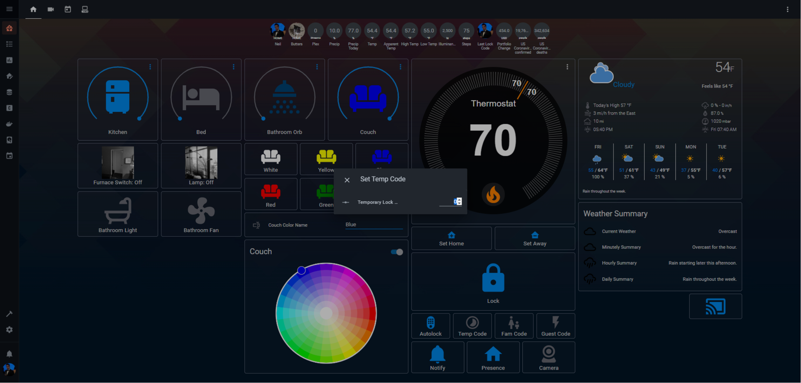
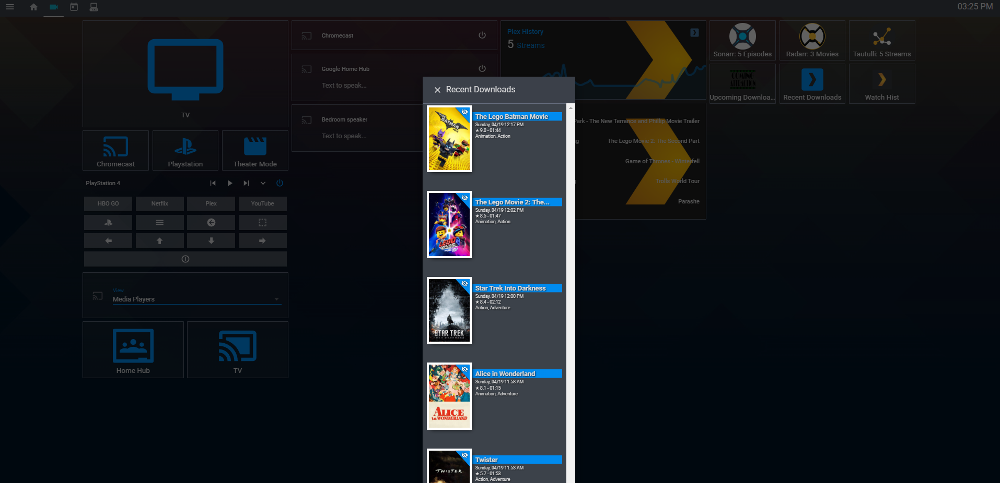

MrNeilix Hass Config
====================

Table of Contents
-----------------

  * [Home](#home)
  * [ScreenShots](#Screenshots)
    * [Main] (#Main)
    * [Media] (#Media)
    * [FitBit] (#Fitbit)
    * [Calendar] (#Calendar)
    * [System] (#System)
    * [Weblinks] (#Weblinks)
  * [Custom Components] (#Custom-Components)
  * [Custom Cards] (#Custom-Cards)
  * [Hardware] (#Hardware)

ScreenShots
===========

Main
----
Main view with Couch Lights Off

Main view with Couch Lights On

Media
-----
Media View with TV Off

Media View with TV On

Media View with Tautulli Popup

Media View with Upcoming Downloads Popup

Media View with Recently Added to Plex Popup

I made a hidden view here using Compact Custom Header and an iFrame, so it'll navigate to the hidden iFrame to Sonarr

I made a hidden view here using Compact Custom Header and an iFrame, so it'll navigate to the hidden iFrame to Radarr

I made a hidden view here using Compact Custom Header and an iFrame, so it'll navigate to the hidden iFrame to Tautulli

Fitbit
------
Fitbit View

Calendar
--------
Calendar and Device Tracker View

Calendar and Device Tracker View With Device Tracker Popup

System
-------
System View

I made a hidden view here using Compact Custom Header, so it'll navigate to the hidden System Monitor View

I made a hidden view here using Compact Custom Header and an iFrame, so it'll navigate to the hidden iFrame to QBittorrent

Weblinks
--------
Router

Vera

QBittorrent

MQTT

Sonarr

Radarr

Custom Components
=================

Sun, Composite Device Tracker, and Illumination Sensor: https://github.com/pnbruckner/homeassistant-config/

Custom Updater: https://github.com/custom-components/custom_updater

Plex Recently Added: https://github.com/custom-components/sensor.plex_recently_added

Sonarr Upcoming: https://github.com/custom-components/sensor.sonarr_upcoming_media

Radarr Upcoming: https://github.com/custom-components/sensor.radarr_upcoming_media

Custom Cards
============

Card | View Used In | Link
---- | ------------ | ----
Card Modder (to updated the background image of a couple cards) | Throughout | https://github.com/thomasloven/lovelace-card-modder

Card Tools (Many of the custom cards have this as a dependency) | Throughout | https://github.com/thomasloven/lovelace-card-tools

Custom Button (Used Throughout) | Throughout | https://github.com/custom-cards/button-card

Popup Card (Used Throughout) | Throughout | https://github.com/thomasloven/lovelace-popup-card

Compact Custom Header | Throughout | https://github.com/maykar/custom-lovelace/tree/master/compact-custom-header

Vertical Stack in Card for hiding the borders that show in a normal vertical stack | Throughout | https://github.com/custom-cards/vertical-stack-in-card

Animated Weather Card | [Main View] (#Main) and [Calendar View] (#Calendar) | https://github.com/bramkragten/custom-ui/tree/master/weather-card

Fold Entity Row (Main View and Calendar View) | [Main View] (#Main) and [Calendar View] (#Calendar) | https://github.com/thomasloven/lovelace-fold-entity-row

Mini Media Player Card for Cast Devices and the PS4 Card inputs and controls | [Media View] (#Media) | https://github.com/kalkih/mini-media-player

Upcoming Media | [Media View] (#Media) | https://github.com/custom-cards/upcoming-media-card

Auto Entries to show hide who is not currently watching my Plex | [Media View] (#Media) | https://github.com/thomasloven/lovelace-auto-entities

Circle Sensor Card | [Fitbit View] (#Fitbit) | https://github.com/custom-cards/circle-sensor-card

Text Element | [Fitbit View] (#Fitbit) | https://github.com/custom-cards/text-element

Atomic Calendar Card for a more detailed and customizable Calendar View | [Calendar View] (#Calendar) | https://github.com/atomic7777/atomic_calendar

Tracker Card | [System View] (#System) | https://github.com/custom-cards/tracker-card

Mini Graph card | [System View] (#System) | https://github.com/kalkih/mini-graph-card

Gauge Card | [System View] (#System) | https://github.com/ciotlosm/custom-lovelace/tree/master/gauge-card

Layout Card for the iFrames | Hidden Views | https://github.com/thomasloven/lovelace-layout-card

Hardware
========

Raspberry Pi 3B

Raspberry Pi Zero W (for Monitor and My TV Control)

Numerous Z Wave Switches

Schlage Camelot Z Wave Lock (Not working anymore)

Monoprice Z Wave Door Sensor (Vera has been annoying about my lock, so I have to use that to tell when the door is opened)

Nexlux WiFi Wireless LED Smart Controller (And a few RGB Strips)

Wemo Switch for my Webcam

Honeywell Wi-Fi Smart RTH9580

Vera Hub for Z-Wave control

Google Home and Chromecast

Join/Tasker on my phone for YouTube TV and presence control

Monitor on my Pi Zero: https://github.com/andrewjfreyer/monitor/blob/master/monitor.sh