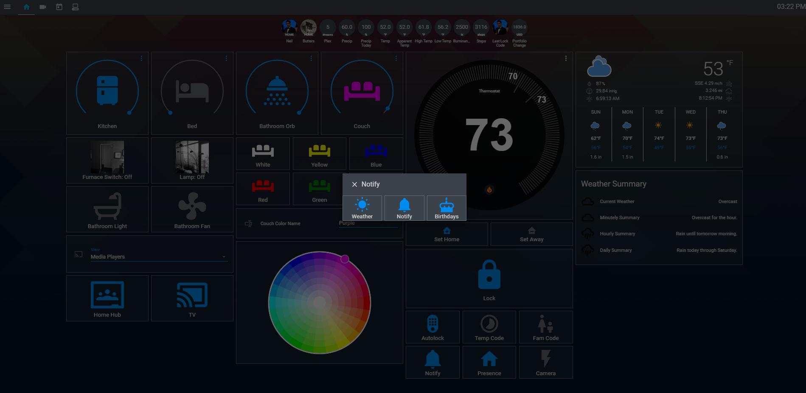
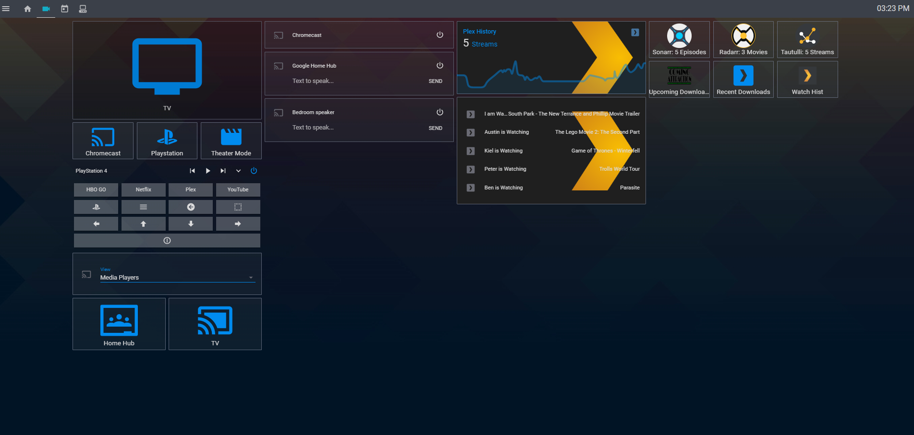
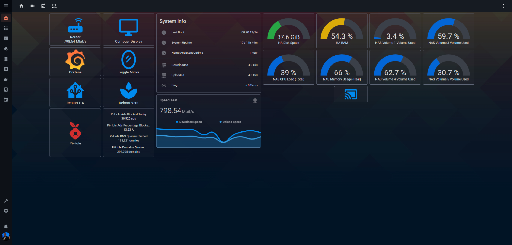

MrNeilix Hass Config
====================

Table of Contents
-----------------

  * [MrNeilix Hass Config](#MrNeilix-Hass-Config)
  * [ScreenShots](#Screenshots)
     * [Main](#Main)
     * [Media](#Media)
     * [FitBit](#Fitbit)
     * [Calendar](#Calendar)
     * [System](#System)
     * [Hidden Views with embedded iFrames](#Hidden-Views-with-embedded-iFrames)
     * [Weblinks](#Weblinks)
  * [Custom Components](#Custom-Components)
  * [Custom Cards](#Custom-Cards)
  * [Hardware](#Hardware)

ScreenShots
===========

Main
----
Main view with Couch Lights Off

Main view with Couch Lights On

Main view with Notification Control Popup

Main view with setting a temporary lock code popup

Fitbit popup

Media
-----
Media View with TV Off

Media View with TV On

Media View with an Popup iFrame to Grafana, showing Tautulli history

Media View with an Popup showing Tautulli history by user

Media View with Upcoming Downloads Popup

Media View with Recently Added to Plex Popup

Calendar
--------
Calendar and Device Tracker View

Calendar and Device Tracker View With Device Tracker Popup

System
------
System View

I made a hidden view here using Compact Custom Header, so it'll navigate to the hidden System Monitor View

Weblinks
--------
Router

Vera

QBittorrent

Sonarr

Radarr

HACS Integrations and Plugins
=================

Hardware
========

Raspberry Pi 4 Running Raspbian Docker on an SSD

Numerous Z Wave Switches

Schlage Camelot Z Wave Lock 

Monoprice Z Wave Door Sensor (Vera has been annoying about my lock, so I have to use that to tell when the door is opened)

Nexlux WiFi Wireless LED Smart Controller (And a few RGB Strips)

Wemo Switch for my Webcam

Honeywell Wi-Fi Smart RTH9580

Vera Hub for Z-Wave control

Google Home and Chromecast

Join/Tasker on my phone for YouTube TV and presence control