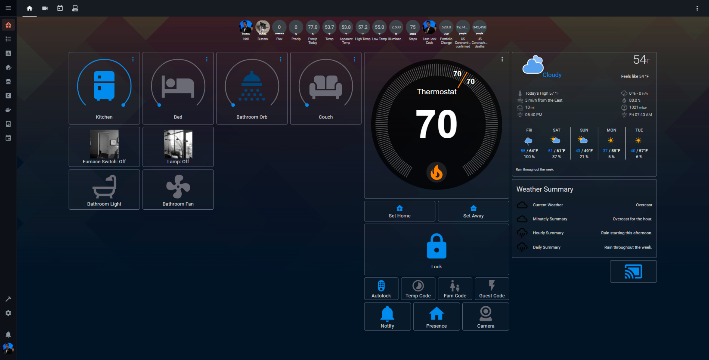
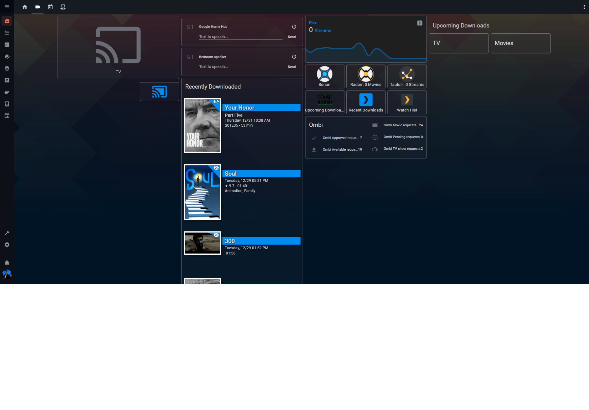
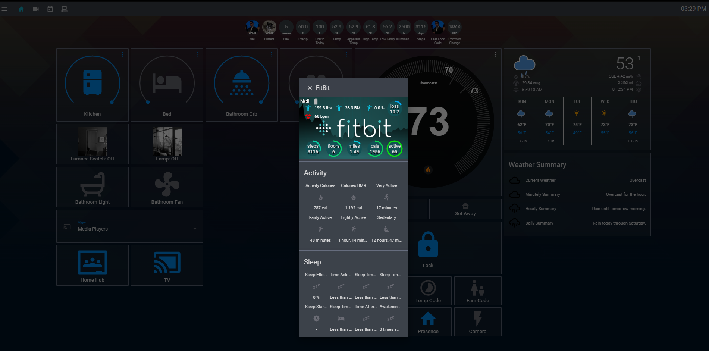

My HassIO Config

##Custom Components:

Monitor on my Pi Zero: https://github.com/andrewjfreyer/monitor/blob/master/monitor.sh

An old version of Tautulli: https://github.com/custom-components/sensor.tautulli

Sun, Composite Device Tracker, and Illumination Sensor: https://github.com/pnbruckner/homeassistant-config/

Custom Updater: https://github.com/custom-components/custom_updater

Plex Recently Added: https://github.com/custom-components/sensor.plex_recently_added

Sonarr Upcoming: https://github.com/custom-components/sensor.sonarr_upcoming_media

Radarr Upcoming: https://github.com/custom-components/sensor.radarr_upcoming_media

## Custom Cards:

Custom Button: https://github.com/kuuji/button-card

Upcoming Media: https://github.com/custom-cards/upcoming-media-card

Compact Custom Header: https://github.com/maykar/custom-lovelace/tree/master/compact-custom-header

Tracker Card: https://github.com/custom-cards/tracker-card

## Hardware:

Raspberry Pi 3B

Raspberry Pi Zero W (for Monitor and My TV Control)

Numerous Z Wave Switches

Schlage Camelot Z Wave Lock

Nexlux WiFi Wireless LED Smart Controller (And a few RGB Strips)

Wemo Switch for my Webcam

Honeywell Wi-Fi Smart RTH9580

Vera Hub for Z-Wave control

Google Home and Chromecast

Join/Tasker on my phone for YouTube TV and presence control